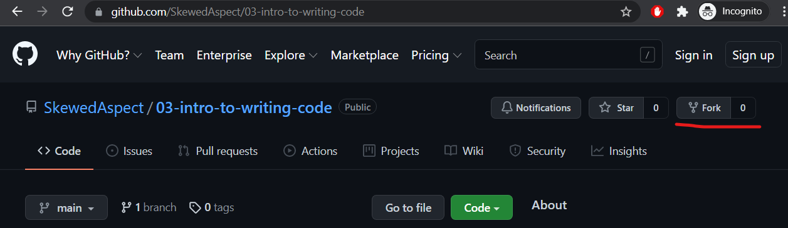
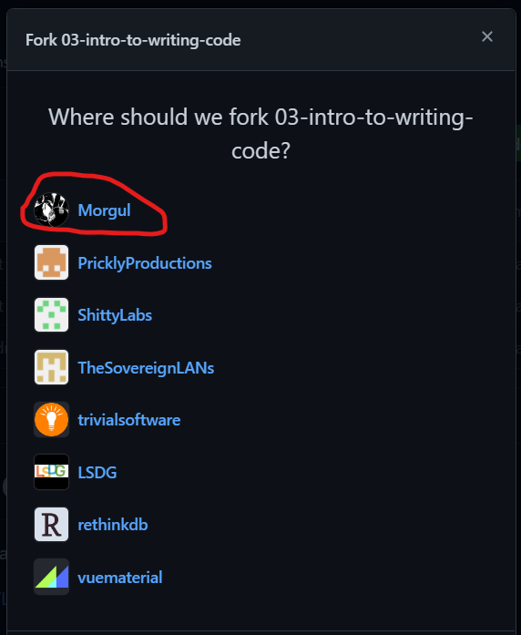
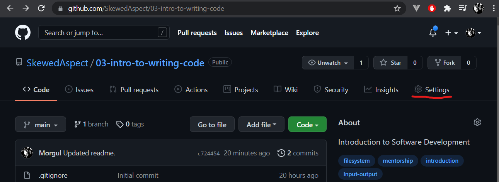
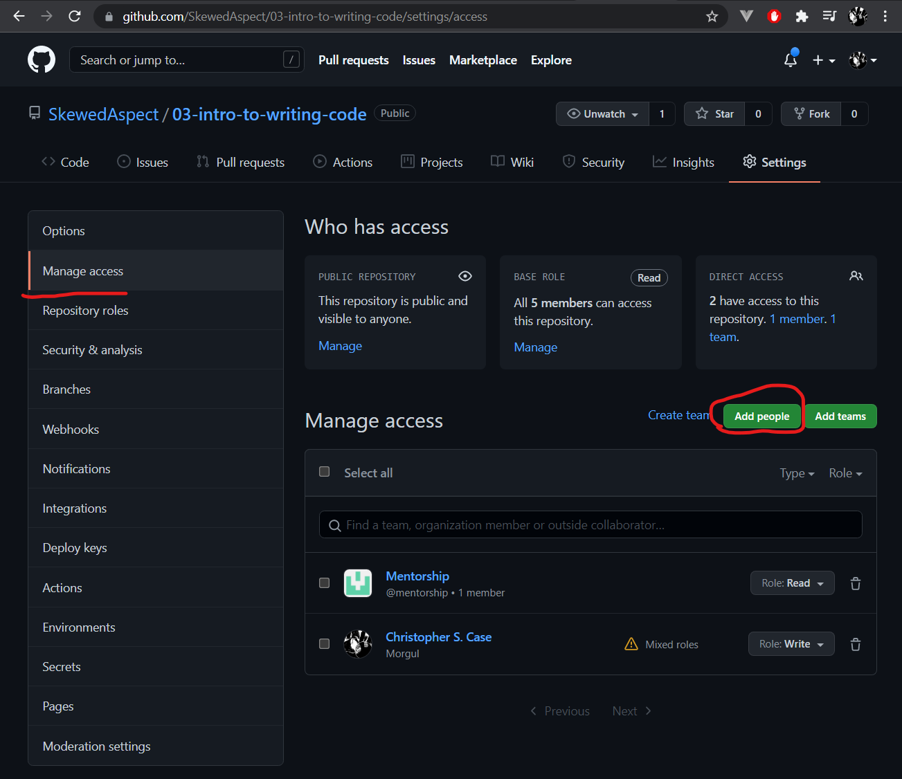
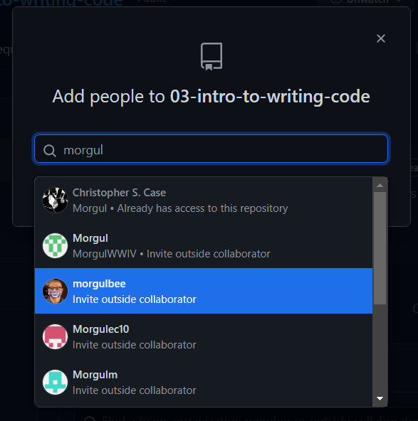
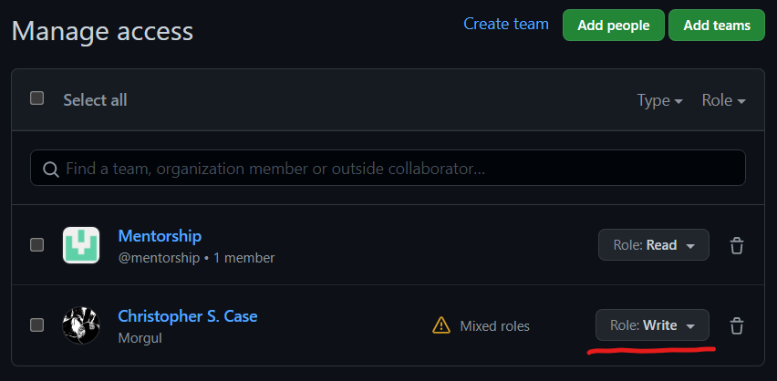

# Introduction to Writing Code

Welcome! This is a brief set of lessons to accompany mentorship lesson 03:

* https://docs.google.com/document/d/1XMVLXHuLWSvyOteRvdkNab7CWAAW4eaMGxuYQsXqLT8/edit?usp=sharing

The goal of these code challenges is to build upon the basics of PC Hardware we've been learning up to this point, and 
reinforce some of those concepts through a brief exposure to writing code. The goal isn't to be able to write any of 
these programs from scratch, just be able to write small pieces, and get comfortable with working inside of existing 
programs to make small modifications.

## Instructions

### Setup

To use this repository, you must first fork it:

And follow the instructions, forking it to your user:

Next, you will need to add your mentor to the project, to make sure they have permissions to review and merge code. To 
do this, go to "Settings":

Next, go to "Manage access" and click "Add people":

Then search for your mentor's username (without the `@`).

Now that you've added them, make sure they have the "Write" permission:

### Getting Started

Once you have the project forked, and your mentor added, you will want to clone it locally. (Follow those git 
instructions from the lesson for how to do that.)

### Submitting Solutions

Once you've completed one of the code challenges, you will need to submit it for review. To do so, you will need to 
make sure that your changes are in a branch, and you will need to put in a "Pull Request", making sure that your mentor
is set as the reviewer.

For a generic set of instructions on how Pull Requests work, check out the GitHub documentation:

* https://docs.github.com/en/pull-requests/collaborating-with-pull-requests/proposing-changes-to-your-work-with-pull-requests/creating-a-pull-request

_**Note:** Because this is a forked project, it will want to make a pull request into the main project. That isn't what 
you want; make sure you're doing a pull request into your own copy._